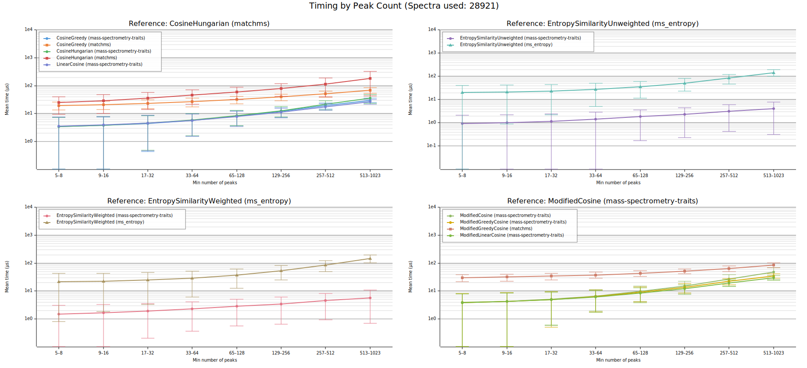
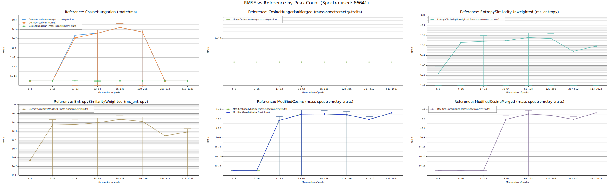

# spectral-cosine-similarity

[](https://github.com/earth-metabolome-initiative/mass-spectrometry-benchmarks/actions/workflows/ci.yml)
[](https://github.com/earth-metabolome-initiative/mass-spectrometry-benchmarks/actions/workflows/audit.yml)

Benchmark pipeline comparing spectral similarity implementations for mass spectra.

## Overview and Main Findings

This report summarizes the current benchmark artifacts (`output/tables.md`, `output/timing.svg`, `output/rmse.svg`). Rust implementations are faster than the corresponding reference implementations in every evaluated family, with observed speedup factors from `1.746x` up to `16.059x` depending on algorithm and peak bucket. Numerical agreement is tight for cosine and entropy families relative to their canonical references, while modified greedy cosine remains visibly farther from exact modified cosine (RMSE up to `2.330e-3` in the largest bucket), so those two should not be treated as numerically interchangeable.

## Benchmark Setup and Scope

The benchmark uses `3000` spectra (`2924` from `ALL_GNPS_cleaned.mgf`, `76` from `pesticides.mgf`) with peak counts in `[5, 1000]` (`mean=206.861`). Pairing is unordered with self-pairs (`left_id <= right_id`), producing `4,501,500` spectrum pairs and `49,516,500` result rows across `11` implementations and `1` experiment configuration.

The experiment parameter set is:

- `tolerance=0.01`
- `mz_power=0.0`
- `intensity_power=1.0`
- `n_warmup=3`
- `n_reps=10`

Each `(implementation, experiment)` is warmed up once on up to `100` representative pending pairs (repeated `n_warmup` times), then each result row stores the median over `n_reps` timed runs. Timing charts aggregate those row-level medians into bucket means. RMSE is computed per bucket against canonical references, with `RMSE_LOG_FLOOR=1e-16` for numerical floor stability in reporting.

Canonical references used for comparison are:

- cosine family: `CosineHungarian (matchms)`
- entropy weighted: `EntropySimilarityWeighted (ms_entropy)`
- entropy unweighted: `EntropySimilarityUnweighted (ms_entropy)`
- modified cosine family: `ModifiedCosine (mass-spectrometry-traits)`

The reference stacks (`matchms`, `ms_entropy`) are Python-facing libraries but rely on compiled numerical backends (including LAPACK/BLAS-linked components in the SciPy stack), so this is not a Rust-vs-pure-Python-loop comparison.

Runtime and machine context for this reported run:

- full pipeline wall time: `3m56.769s` (`cargo run --release -- --max-spectra 3000`)
- DB size after checkpoint and vacuum: `2,067,652,608` bytes (`~2.0 GiB`)
- host: `Ubuntu 24.04.4 LTS`, kernel `6.17.0-14-generic`, `AMD Ryzen Threadripper PRO 5975WX` (`64` logical CPUs), `1.0 TiB` RAM, `Python 3.12.7`, `uv 0.9.30`, `rustc/cargo 1.95.0-nightly`

In this setup, storage footprint is a stronger practical constraint than RAM demand.

## Plots and Tables





Raw numeric tables for all buckets/series are in [`output/tables.md`](output/tables.md).

## Performance Findings

Relative factor is computed bucket-wise as `reference_mean_time / rust_mean_time`.

| Family | Rust vs reference implementation | Relative factor range across buckets |
| --- | --- | --- |
| CosineGreedy | `mass-spectrometry-traits` vs `matchms` | `1.919x` to `4.683x` |
| CosineHungarian | `mass-spectrometry-traits` vs `matchms` | `4.151x` to `5.758x` |
| ModifiedGreedyCosine | `mass-spectrometry-traits` vs `matchms` | `2.351x` to `6.625x` |
| EntropySimilarityWeighted | `mass-spectrometry-traits` vs `ms_entropy` | `1.746x` to `6.089x` |
| EntropySimilarityUnweighted | `mass-spectrometry-traits` vs `ms_entropy` | `2.998x` to `16.059x` |

The `513-1023` bucket has much smaller support (`n=25,878`) than mid-range buckets, so edge-bucket swings should be interpreted with that sample-size gap in mind.

## Accuracy Findings (RMSE vs Canonical Reference)

### Cosine family (reference: `CosineHungarian (matchms)`)

- `CosineHungarian (mass-spectrometry-traits)`: `1.000e-16` to `1.004e-16`
- `CosineGreedy (mass-spectrometry-traits)`: `1.000e-16` to `7.697e-6`
- `CosineGreedy (matchms)`: `1.000e-16` to `7.671e-6`

### Entropy family (reference: `ms_entropy`)

- `EntropySimilarityUnweighted (mass-spectrometry-traits)`: `3.702e-9` to `6.235e-8`
- `EntropySimilarityWeighted (mass-spectrometry-traits)`: `5.198e-9` to `7.348e-8`

### Modified cosine family (reference: `ModifiedCosine (mass-spectrometry-traits)`)

- `ModifiedGreedyCosine (mass-spectrometry-traits)`: `3.337e-5` to `2.330e-3`
- `ModifiedGreedyCosine (matchms)`: `3.340e-5` to `2.330e-3`

Pair counts per peak bucket (`output/tables.md`):

- `5-8`: `390,222`
- `9-16`: `611,943`
- `17-32`: `853,185`
- `33-64`: `1,018,040`
- `65-128`: `658,582`
- `129-256`: `514,947`
- `257-512`: `428,703`
- `513-1023`: `25,878`

Cosine and entropy families remain near their references on this run, while modified greedy variants preserve a larger error band relative to exact modified cosine.

## Methodological Limits and Improvement Priorities

Current limits:

- Only one experiment parameter set is benchmarked.
- No denoising, windowed top-k filtering, precursor-peak removal, or intensity normalization is applied.
- Ingest rejects spectra with missing metadata, out-of-bounds peak counts, duplicate `m/z`, and nonpositive-intensity peaks.
- Timing is microbenchmark-style per pair; this is not end-to-end throughput/system benchmarking.
- The DB schema has no run identifier table; results are cumulative for a DB state, not versioned as isolated benchmark runs.
- There is no external-library exact `ModifiedCosine` implementation in the current comparison set.

Priority improvements:

1. Add a parameter grid (`tolerance`, `mz_power`, `intensity_power`) instead of a single configuration.
2. Add optional preprocessing variants (normalization/sanitization pipeline switches) and report them as separate experiment sets.
3. Add run provenance (`run_id`, timestamp, hardware/runtime metadata, git revisions) and produce run-scoped reports.
4. Add distributional timing stats (for example p50/p95/p99 and tails), not only mean and standard deviation.
5. Add an explicit external-reference baseline for exact modified cosine when available.

## Reproducibility

Pinned dataset source:

- Zenodo record `11193898`, file `ALL_GNPS_cleaned.mgf`
- local cache path: `fixtures/ALL_GNPS_cleaned.mgf`

Run the pipeline for the same report scope:

```bash
cargo run --release -- --max-spectra 3000
```

Run with ntfy notifications:

```bash
cargo run --release -- --max-spectra 3000 --ntfy
```
